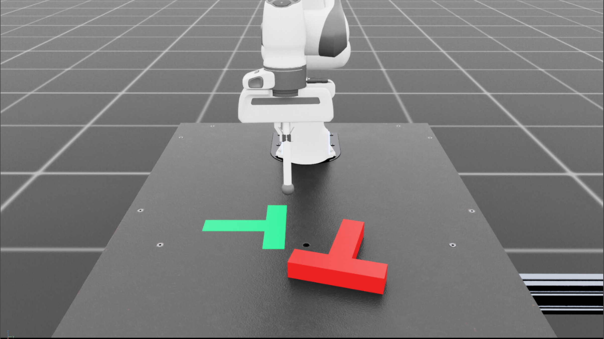

# Isaac-Pusht-v0 

## Overview

This repository contains the code for the Isaac-Pusht-v0 task.
<div style="display: flex; justify-content: center;">
  
</div>

## Installation

- Install Isaac Lab by following the [installation guide](https://isaac-sim.github.io/IsaacLab/main/source/setup/installation/index.html).
  We recommend using the conda or uv installation as it simplifies calling Python scripts from the terminal.

- Clone or copy this project/repository separately from the Isaac Lab installation (i.e. outside the `IsaacLab` directory):

- Using a python interpreter that has Isaac Lab installed, install the library in editable mode using:

    ```bash
    # use 'PATH_TO_isaaclab.sh|bat -p' instead of 'python' if Isaac Lab is not installed in Python venv or conda
    python -m pip install -e source/isaac_pusht
    ```

- Verify that the extension is correctly installed by:

    - Listing the available tasks:

        Note: It the task name changes, it may be necessary to update the search pattern `"Template-"`
        (in the `scripts/list_envs.py` file) so that it can be listed.

        ```bash
        python scripts/list_envs.py
        ```

    - Running with keyboard teleoperation:

        ```bash
        python scripts/teleop_se3_agent.py --task Isaac-Pusht-v0 
        ```

    - Running a task with dummy agents:

        These include dummy agents that output zero or random agents. They are useful to ensure that the environments are configured correctly.

        - Zero-action agent

            ```bash
            python scripts/zero_agent.py --task=Isaac-Pusht-v0 
            ```
        - Random-action agent

            ```bash
            python scripts/random_agent.py --task=Isaac-Pusht-v0 
            ```
