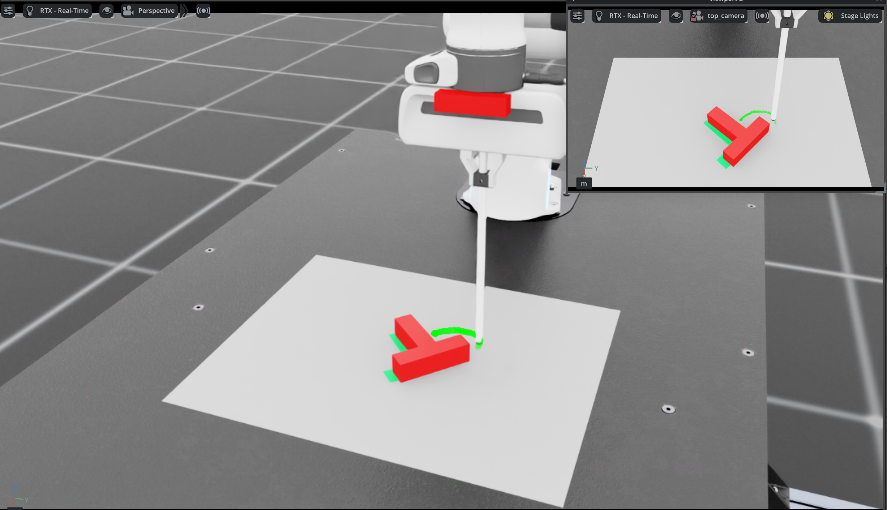

# Isaac-Pusht-v0 & Diffusion Policy

## 概述

本仓库提供了IsaacLab PushT环境代码 `Isaac-Pusht-v0`, 并提供完整Diffusion Policy 数据采集、回放以及策略训练、推理管线，效果[参见](https://www.bilibili.com/video/BV1t2L26HEN5/)。

<div style="display: flex; justify-content: center;">
  
</div>


## 快速开始

### 安装

1. 安装 Isaac Lab

[installation guide](https://isaac-sim.github.io/IsaacLab/main/source/setup/installation/index.html)

2. 安装本仓库

```bash
git clone https://github.com/yueduduo/isaac_pushT.git
cd isaac_pushT
python -m pip install -e source/isaac_pusht
```

3. 安装 lerobot

```bash
wget -O lerobot.zip https://github.com/huggingface/lerobot/archive/refs/tags/v0.4.4.zip
unzip lerobot.zip
mv lerobot-0.4.4 lerobot
rm lerobot.zip
cd lerobot
pip install -e .
```

### 数据收集与回放

1. 手动采集

```bash
python scripts/record_lerobot.py --task Isaac-Pusht-v0 --num_episodes 200 --enable_cameras
```

- 采集的数据默认保存在`项目根目录/data/isaac_pusht`目录。
- 请注意：采集的数据质量严重影响Diffusion Policy的训练效果。

另：目前已有的数据(质量尚可)，参见[地址](https://www.modelscope.cn/datasets/yueduduo/isaac_pusht)

2. 数据回放

- isaaclab 回放

```bash
python scripts/record_lerobot_replay.py --repo_id isaac_pusht --root data/isaac_pusht --episode_idx 0 --enable_cameras
```

- lerobot viz

```bash
python -m lerobot.scripts.lerobot_dataset_viz --repo-id isaac_pusht --root data/isaac_pusht --episode-index 0
```

### Diffusion Policy 训练

```bash
python scripts/train.py --config scripts/configs/train_default.json
```
默认仅保存best和last权重, 路径位于`项目根目录/checkpoints`

训练时可以使用 `tensorboard` 查看训练信息 
```bash
tensorboard --logdir runs
```
另：目前已有的权重(质量尚可)，参见[地址](https://www.modelscope.cn/models/yueduduo/isaac_pusht_lerobot_dp/files)


### 策略推理
1. **Inference server** (no Isaac; needs PyTorch + project `utils` + `lerobot` on `PYTHONPATH`):
```bash
python scripts/serve_push_diffusion_ws.py --checkpoint checkpoints/best_diffusion.pt --horizon 32 --device cuda:0 --host 0.0.0.0 --port 8765
```

2. **Simulator client** — point **`--policy-host`** at the server IP and set **`--policy-port`** (default `8765`):

```bash
pip install websockets msgpack

python scripts/eval_model.py --task Isaac-Pusht-v0 --policy-host localhost --policy-port 8765 --horizon 32 --enable_cameras --debug-draw
```


